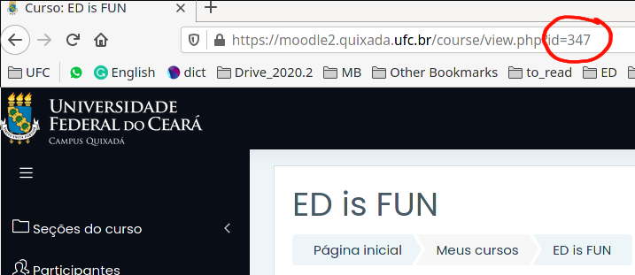
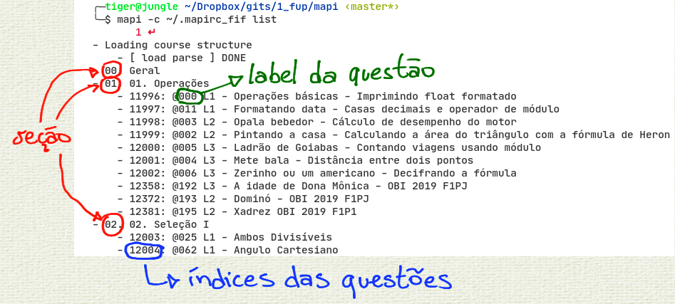
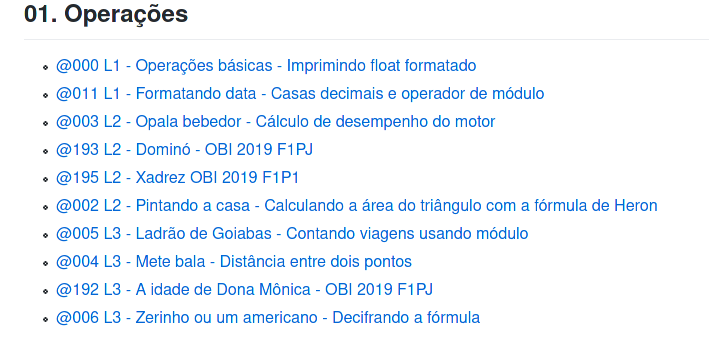

<!--TOC_BEGIN-->
- [Configurações da ferramenta](#configurações-da-ferramenta)
- [Configurando acesso ao curso](#configurando-acesso-ao-curso)
- [Listando estrutura de um curso](#listando-estrutura-de-um-curso)
- [Adicionando](#adicionando)
    - [Utilizando labels](#utilizando-labels)
    - [Inserindo questões duplicadas](#inserindo-questões-duplicadas)
    - [Definindo horário de finalizar atividade](#definindo-horário-de-finalizar-atividade)
- [Removendo](#removendo)
- [Update](#update)
- [Criando suas próprias questões](#criando-suas-próprias-questões)
<!--TOC_END-->

# MoodleAPI


API de publicação automática de VPL's no Moodle/Moodle2

É necessário primeiro baixar as bibliotecas mechanicalsoup e bs4 usando o pip

## Configurações da ferramenta
Instale o python e o pip. Depois instale as dependências com

```
pip install mechanicalsoup bs4
```

baixe o arquivo `mapi.py`, coloque como executável, e adicione a algum lugar do seu path.

Se não quiser adicionar diretamente no path, você terá que invocá-lo diretamente utilizando

```bash
$ python mapi.py
#ou
$ chmod +x mapi.py
$ ./mapi.py
```

Pode também incluir um alias no seu arquivo ".bashrc" ou ".zshrc" para chamar o script de qualquer lugar

```bash
#arquivo .bashrc
alias mapi='/path/completo/para/mapi.py'
```

pronto, agora basta invocar mapi de qualquer pasta. A partir de agora, vou me referir ao comando apenas como `mapi`. Para conferir a instalação, basta abrir o terminal e digitar `mapi -h`.

## Configurando acesso ao curso


### Modo rápido
Para criar o arquivo default com o acesso ao seu curso basta executar o seguinte comando no terminal, substituindo os valores de usuário, senha e número do curso do moodle. Os campos de url e remote já estão configurados para o curso de fup. Será criado um arquivo .mapirc na sua pasta home.

```bash
$ mapi setup --username SEU_USUARIO --password SUA_SENHA --course O_NUMERO_DO_SEU_CURSO_DO_MOODLE \
--url https://moodle2.quixada.ufc.br --remote https://raw.githubusercontent.com/qxcodefup/moodle/master/base
```

Para obter o número do curso, basta olhar o último número na URL do seu curso do moodle.



Se não passar o parâmetro --password, a senha será perguntada em cada utilização.

Agora basta dar um `mapi list` para listar o conteúdo do seu curso. Ou `./mapi.py list` dependendo de se ele está no seu path ou não.

### Modo personalizado

Você pode criar arquivos de configuração para diferentes cursos do moodle. Você pode criar um arquivo `curso.json` com o seguinte formato e valores.
```
{
    "username": "seu_login",
    "password": "sua_senha",
    "course": "numero_do_curso",
    "url": "url_do_moodle",
    "remote": "url do repositório remoto de questões"
}
```

Se estiver utilizando o moodle2 da UFC de Quixadá e for trabalhar com a disciplina FUP, seu arquivo será igual a esse, mudando apenas os três primeiros campos.

```
{
    "username": "jiraya",
    "password": "espadaOlimpica123",
    "course": "516",
    "url": "https://moodle2.quixada.ufc.br",
    "remote": "https://raw.githubusercontent.com/qxcodefup/moodle/master/base"
}
```

Se preferir, pode deixar o campo password com valor null `"password": null`. O script vai perguntar sua senha em cada operação.

Se não estiver utilizando o arquivo de configuração padrão, terá que passar seu curso sempre por parâmetro na invocação do script. Se tiver utilizando o alias, pode deixar o parâmetro fixo integrado no alias

```bash
#arquivo .bashrc
alias mapi='/path/completo/para/mapi.py -c /path/completo/para/curso.json'
```


## Listando estrutura de um curso

Para saber se está funcionando, você pode listar as questões do seu curso. Você pode ter múltiplos arquivos de configuração, um para cada curso.

```
$ mapi -c curso.json list
```

Quando estiver povoado, a saída será como a da figura abaixo.


Você pode salvar o arquivo de configuração no seu diretório `home` como `.mapirc` e será o arquivo carregado por default caso não seja explicitado outro arquivo.

```
$ mapi list
```

Para todo o resto do tutorial, vamos omitir o parâmetro do arquivo de configuração.

## Adicionando

### Utilizando labels

O procedimento padrão para inserção é utilizando as questões do repositório remoto configurado no arquivo de configurações. Para FUP, o repositório padrão está no [github](https://github.com/qxcodefup/arcade#qxcodefup). Depois, você vai aprender a criar e formatar as próprias questões. No repositório, cada questão tem um `label` único no formato de `@xxx`.



Para enviar a questão `@192 A idade de Dona Mônica` para a seção 5 do seu curso do moodle use:

```bash
$ mapi add 195 --section 5
```

Ou de forma resumida

```bash
$ mapi add 195 -s 5
```

É possível enviar várias questões ao mesmo tempo com o mesmo comando. Para enviar 002, 003, 004 e 006 para a seção 5:

```
$ mapi add 002 003 004 006 -s 5
```

### Inserindo questões duplicadas
O procedimento default se você enviar duas questões com o mesmo label para a mesma seção, o procedimento padrão é de atualizar a questão pre-existente. Você pode forçar a inserção duplicada com `--force` ou pular a questão caso ela já exista com `--skip` para o comando `add`.

### Definindo horário de finalizar atividade

Por default, as questões são inseridas sem prazo para fechamento da atividade. No caso de provas ou testes, você pode inserir questões definindo o horário de fechamento com o parâmetro `--duedate yyyy:m:d:h:m`.

## Removendo
```bash
# para remover todos os vpls da seção 4
$ mapi rm -s 4

# para remover as questões passando os IDS
$ mapi rm -i 19234 18234 19234

# para remover TODOS os vpls do curso
$ mapi rm --all
```

## Update, Rm e Download
Update pode ser utilizado para
- Habilitar as opções de execução das questões que você criou manualmente
- Atualizar as questões utilizando o label e buscando no repositório por updates.
- Atualizar a data de finalização da questão.

Você pode solicitar atualização por label, índice ou para todos as questões de uma seção.

```bash
# desabilitando a data de término (duedate) de todas as questões da seção 4 com -s ou --sections
$ mapi update -s 4 --duedate 0

# colocando um duedate específico yyyy:m:d:h:m da questão de label @023 com -l ou --labels
$ mapi update -l 023 --duedate 2021:5:28:11:30

# habilitando as opções de execução para todas as questões do cursos
$ mapi update --all --exec-options

# atualizando todas as suas questões por label utilizando a versão mais atual do servidor remoto
$ mapi update --all --remote
```

## Removendo e Baixando.
Remover utiliza os mesmos parâmetros -l (labels), -s (sections), -a(all), -i(ids).

O comando de download baixa a questão do moodle para seu computador num formato que permite alteração e reenvio ao moodle.

Para reinserir uma questão baixada do moodle, basta utilizar o parâmetro --local no add.
